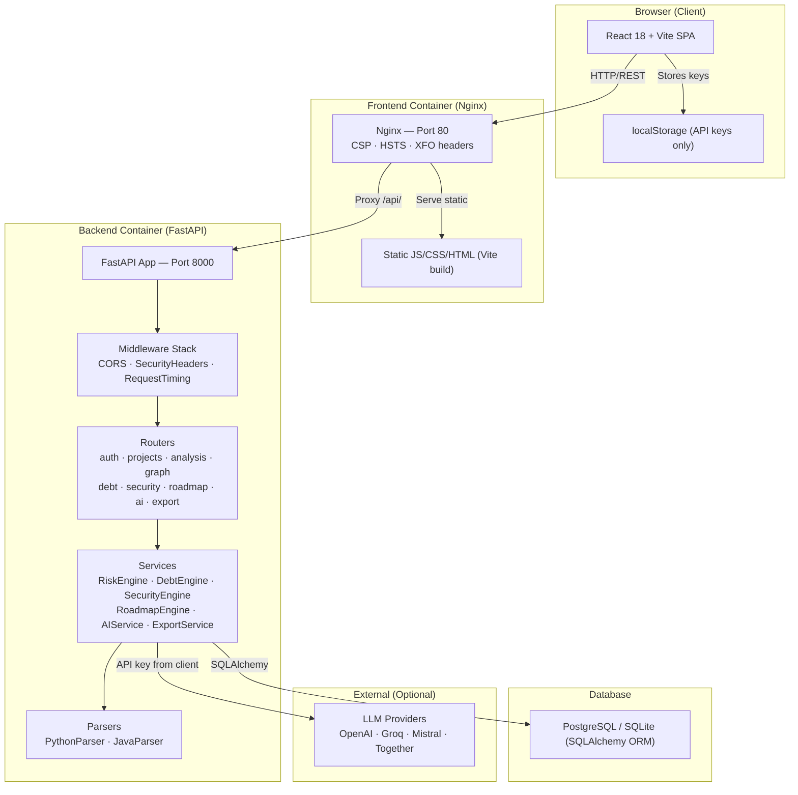
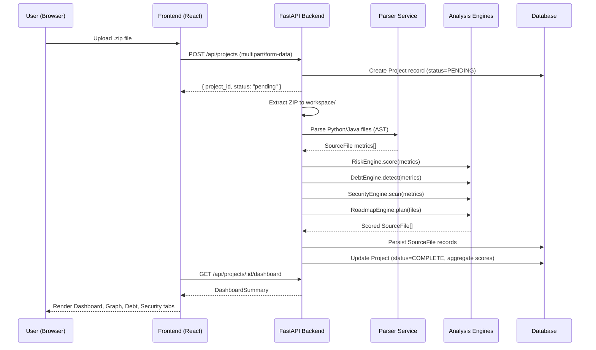
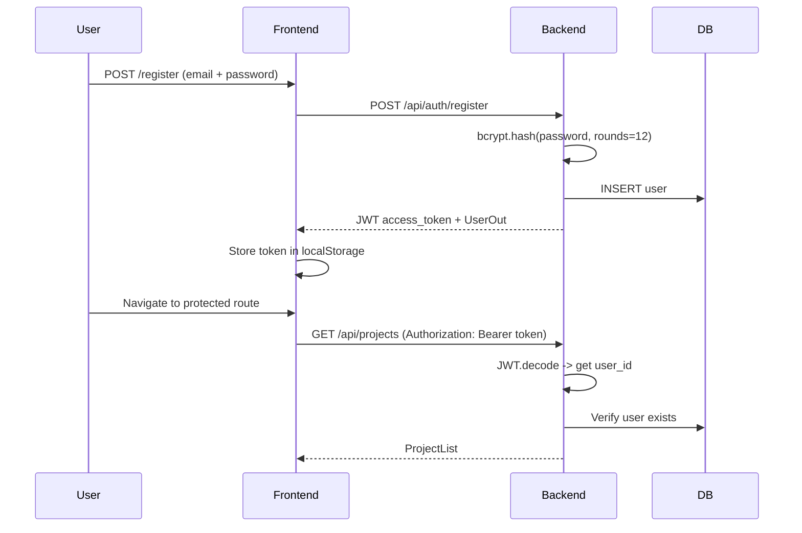

# LegacyLens — System Architecture

## Overview

LegacyLens is a full-stack, containerised web application consisting of three primary services: a React/Vite frontend, a FastAPI backend, and a PostgreSQL database. In production, Nginx reverse-proxies the frontend and forwards `/api/` traffic to the backend container.

---

## High-Level Component Diagram



---

## Data Flow — File Analysis Pipeline



---

## Authentication Flow



---

## Security Model

| Layer | Control |
|---|---|
| **Transport** | HTTPS in production (HSTS enabled in nginx.conf) |
| **Frontend headers** | CSP, X-Frame-Options, X-Content-Type-Options, Referrer-Policy, Permissions-Policy |
| **Backend headers** | Same headers as defence-in-depth via `SecurityHeadersMiddleware` |
| **Authentication** | JWT tokens, bcrypt password hashing (cost 12) |
| **API key handling** | Keys stored only in browser `localStorage`, never persisted to DB |
| **Secret redaction** | `_redact_secrets()` strips 16+ char tokens before sending to LLM |
| **No raw code** | Raw source code is never sent externally — only structured metric summaries |
| **Input validation** | Pydantic v2 schemas validate all incoming requests |
| **Slow request logging** | `RequestTimingMiddleware` logs requests > 500 ms |

---

## Directory Structure

```
LegacyLens/
├── .github/workflows/ci.yml       # CI: lint · typecheck · security scan · test · coverage
├── backend/
│   ├── app/
│   │   ├── main.py                # FastAPI app, middleware stack, lifespan
│   │   ├── config.py              # pydantic-settings (env vars)
│   │   ├── database.py            # SQLAlchemy engine + session factory
│   │   ├── dependencies.py        # JWT auth dependency, project ownership check
│   │   ├── models/models.py       # ORM models: User, Project, SourceFile, DebtItem, SecurityFinding
│   │   ├── schemas/schemas.py     # Pydantic request/response schemas
│   │   ├── routers/               # One router per feature domain
│   │   └── services/
│   │       ├── risk_engine.py     # Weighted metric scoring formula
│   │       ├── debt_engine.py     # God class / long method / circular dep detection
│   │       ├── security_engine.py # Regex + AST secret/API key detection
│   │       ├── roadmap_engine.py  # Topological phase planning
│   │       ├── ai_service.py      # Multi-provider LLM integration (OpenAI SDK)
│   │       ├── export_service.py  # PDF (ReportLab) + DOCX report generation
│   │       └── parsers/
│   │           ├── python_parser.py   # Python ast module
│   │           └── java_parser.py     # Regex-based Java parser
│   └── tests/                     # pytest suite (auth, engines, parsers, API lifecycle)
├── frontend/
│   ├── nginx.conf                 # Reverse proxy + security headers + gzip compression
│   └── src/
│       ├── App.tsx                # Routes + React.lazy + Suspense (code-splitting)
│       ├── api/client.ts          # Axios instance + typed API call functions
│       ├── context/AuthContext.tsx
│       ├── types/index.ts         # Shared TypeScript interfaces
│       ├── pages/                 # LandingPage · ProjectsPage · AnalysisPage · SettingsPage
│       └── components/
│           ├── Dashboard/         # DashboardSummary (overview cards)
│           ├── DebtDashboard/     # TDR formula card + CSV export
│           ├── DependencyGraph/   # ReactFlow + click-to-highlight + inspect panel
│           ├── Roadmap/           # RoadmapView with ReactFlow layout
│           ├── SecurityDashboard/ # Security findings table + charts
│           └── shared/            # Navbar · ScoreGauge · RiskBadge · ProtectedRoute
├── docs/
│   ├── ARCHITECTURE.md            # This file — system diagrams
│   └── API.md                     # API endpoint reference
├── docker-compose.yml
└── README.md
```

